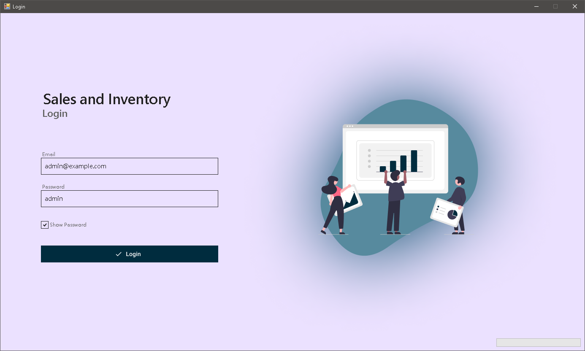
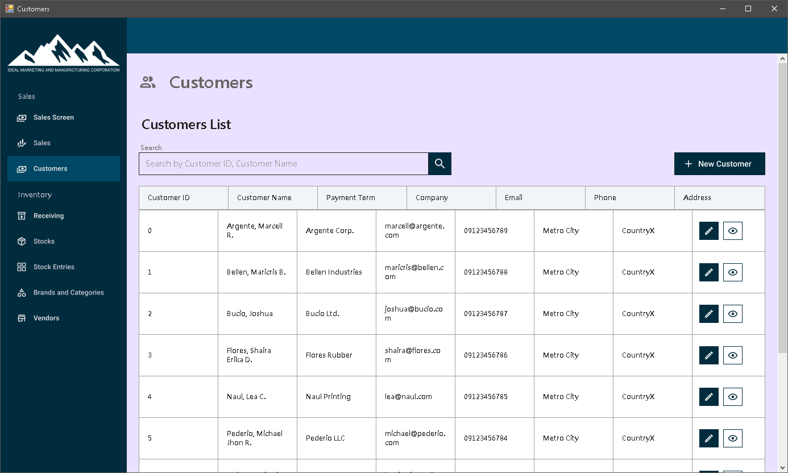
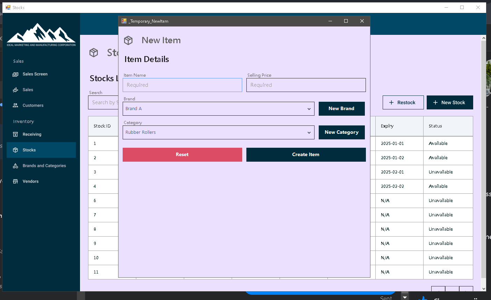
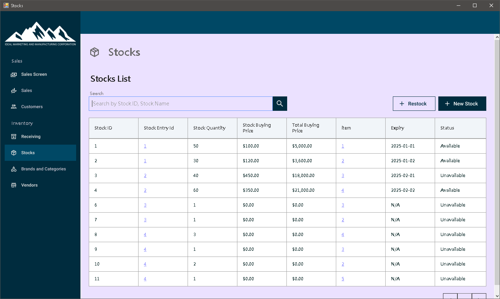
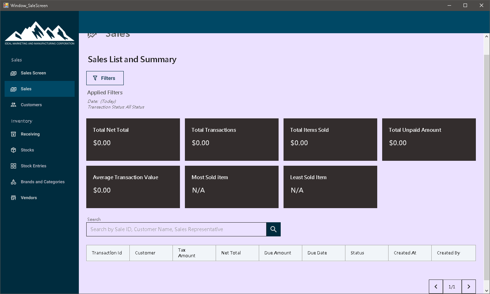
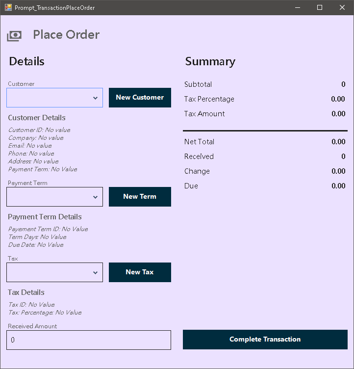
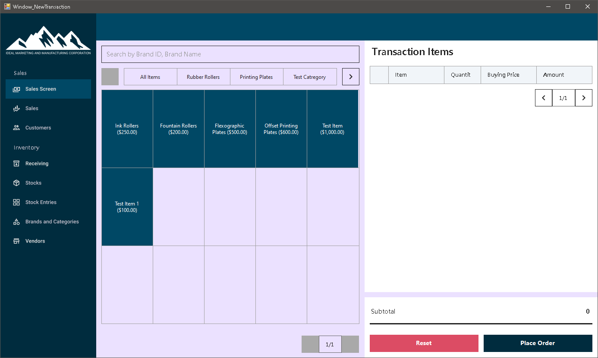
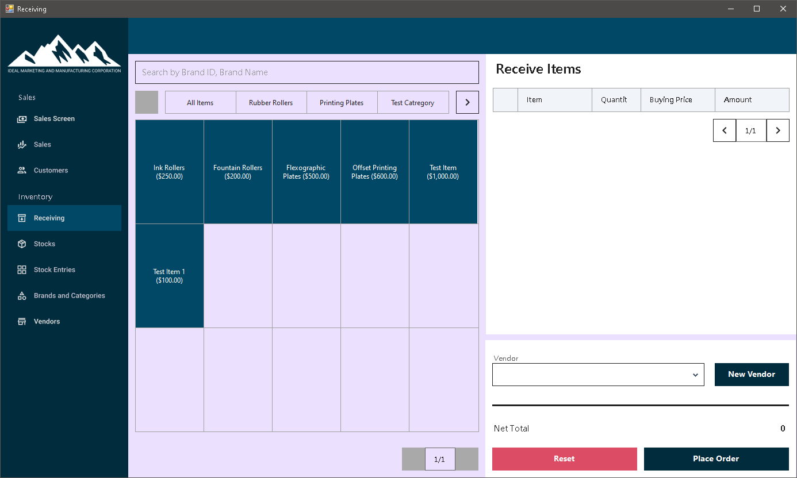
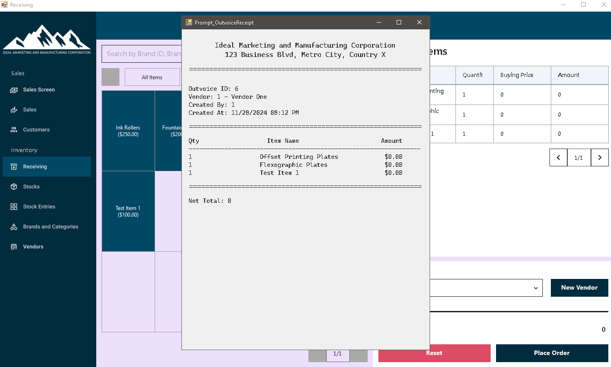
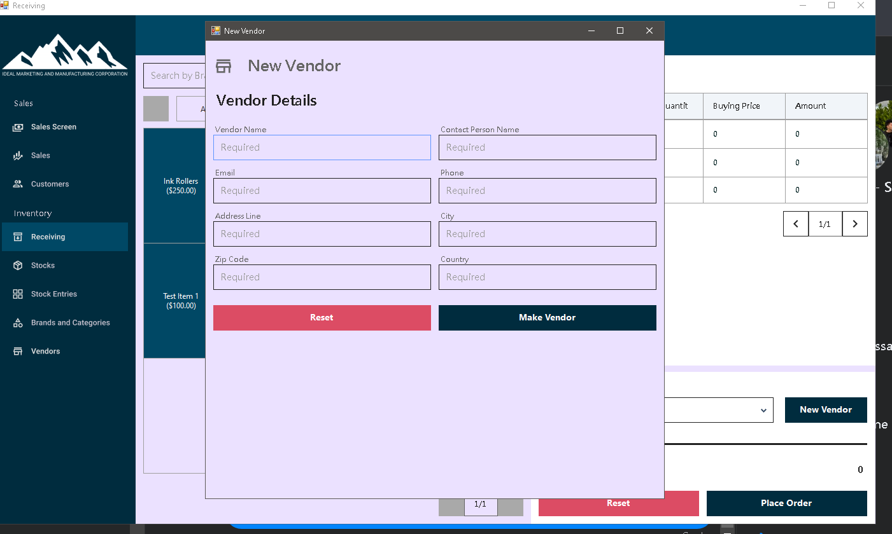

# Enterprise Sales and Inventory Management System

A desktop-based Sales and Inventory Management System (SIMS) developed in **VB.NET** using **Guna UI** components and built with **Visual Studio 2022**. This system is designed for small to medium-sized enterprises to streamline inventory tracking, sales recording, order processing, and vendor/customer management.

---

## 🛠️ Technologies Used

- **VB.NET** (.NET Framework)
- **Guna UI 2** – modern UI components for Windows Forms
- **Visual Studio 2022**

---

## 🚀 Features

- 🔐 **Login System** – Secure authentication for users
- 🧑‍🤝‍🧑 **Customer Management** – Add, update, and delete customer records
- 📦 **Inventory Management** – Track item stock, receive items, and monitor levels
- 🛒 **Sales Transactions** – Place orders, generate receipts, and view sales history
- 🚚 **Vendor Management** – Add and manage supplier information
- 📊 **Admin Dashboard** – Admin-level access to monitor and manage system-wide operations

---

## 🖥️ Screenshots

> All screenshots are located in the `/screenshots` folder.

| Screen | Preview |
|--------|---------|
| Login |  |
| Customers |  |
| New Item |  |
| Stocks |  |
| Sales (POS) |  |
| Place Order |  |
| Sales Item (Admin View) |  |
| Receiving |  |
| Receipt Receiving |  |
| New Vendor |  |
